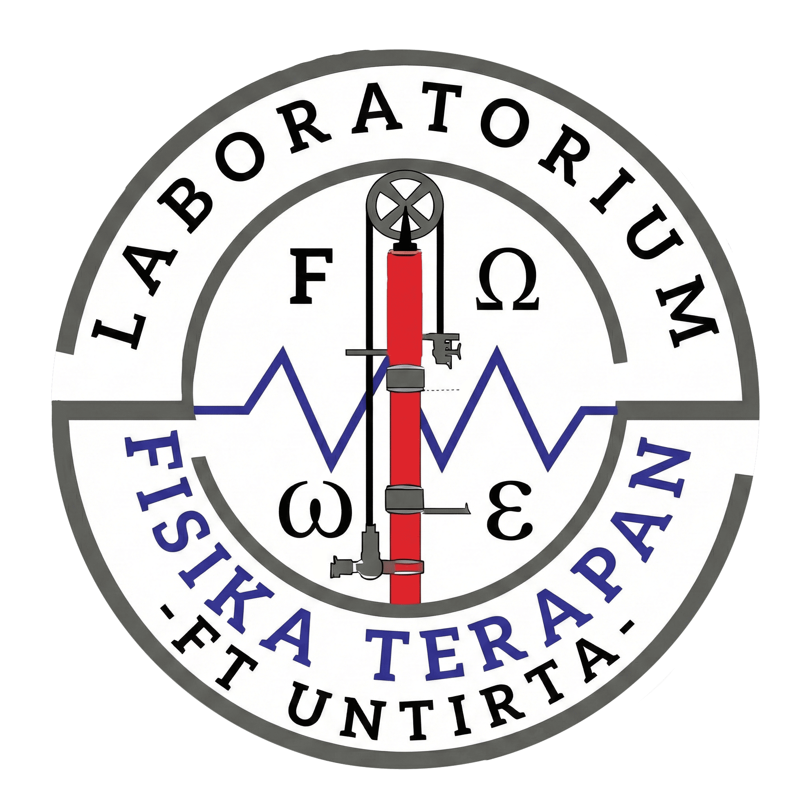

# Sistem Informasi Lab. Fisika Terapan

**platform untuk manajemen praktikum di Laboratorium Fisika Terapan, Fakultas Teknik UNTIRTA.**

[Website](https://lab-fister.vercel.app) · [Laporan Bug](https://github.com/username/repo/issues) · [Request Fitur](https://github.com/username/repo/issues)

---

## 💥 Tentang

Web ini merupakan platform untuk pengelolaan praktikum Fisika supaya menjadi lebih efisien dan mudah.

## 👍Fitur Unggulan

### 🎓 Untuk Praktikan
* **Presensi:** Form presensi mudah dengan validasi Modul, Shift, dan Putaran.
* **Transparansi Nilai:** Cek nilai praktikum secara *real-time* (dengan fitur buka-tutup transparansi oleh Admin).
* **Info Kelompok:** Lihat anggota kelompok dan jadwal praktikum.
* **Ringkasan Akademik:** Statistik modul selesai dan predikat nilai otomatis.

### 👨‍🏫 Untuk Asisten & Admin
* **Manajemen Nilai:** Input nilai TP, TA, Alat, dan Jurnal dengan kalkulasi otomatis.
* **Repositori Link:** Manajemen file materi yang terpusat.
* **Admin:** Manajemen user, reset password, atur kelompok, dan tombol transparansi nilai.

---

**Dibuat dengan ❤️**

